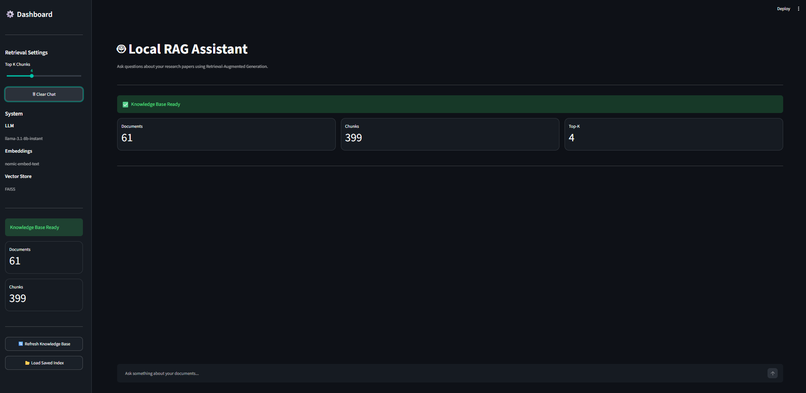
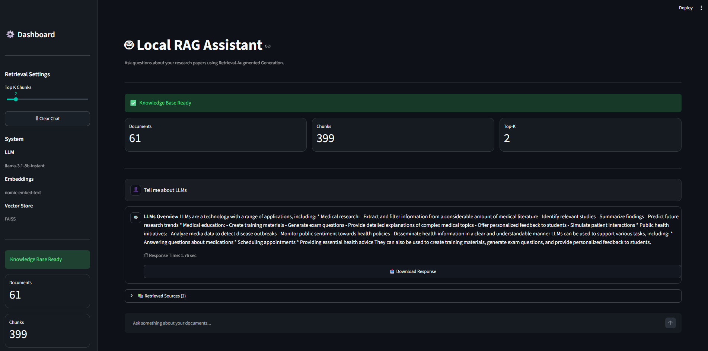
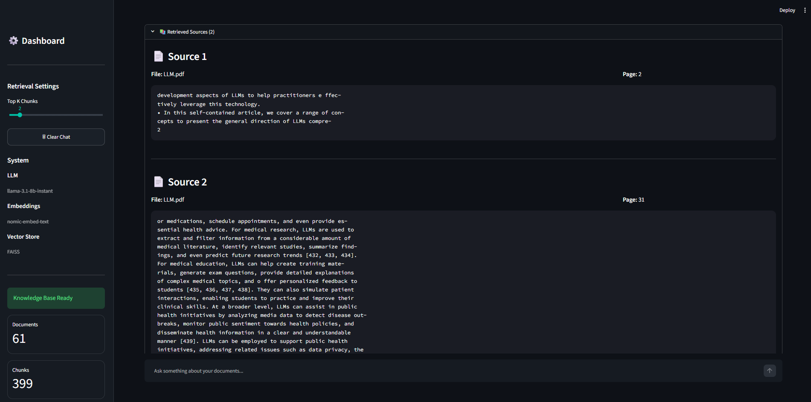

# 🤖 Local RAG Assistant

> **Production-oriented Retrieval-Augmented Generation (RAG) chatbot** built with Streamlit, LangChain, Ollama Embeddings, FAISS, Docker, and Groq.

---

# 📸 Demo

> **Demo GIF**

`docs/demo.gif`

---

# 🖼 Screenshots

## Home


## Chat


## Sources


---

# Features

- Automatic PDF discovery from `research_papers/`
- Automatic index rebuild when PDFs change
- Manual knowledge base refresh
- FAISS vector database
- Ollama local embeddings (`nomic-embed-text`)
- Groq Llama 3.1 inference
- Conversation history
- Source citations with file and page
- Response download
- Dockerized deployment
- Configurable Top-K retrieval

---

# Architecture

```text
                User
                  │
            Streamlit UI
                  │
        Retrieval Chain (LangChain)
          │                  │
          │                  ▼
          │            Groq LLM
          ▼
       FAISS Retriever
          │
          ▼
 Ollama Embeddings
          │
          ▼
 Research Papers (PDFs)
```

---

# Automatic Indexing

On startup:

1. Scan `research_papers/`
2. Compare PDF metadata with saved metadata
3. If unchanged → load FAISS
4. If changed → rebuild embeddings
5. Save updated metadata

## Persisted index trust boundary

The local FAISS store contains a pickle-backed document mapping because of the
current LangChain FAISS persistence format. The application does not load that
mapping until a separate manifest verifies the expected schema, embedding
provider, embedding model, artifact sizes, and SHA-256 checksums. Index files
that are missing, modified, incompatible, or created without a manifest are
rejected and rebuilt instead of being treated as a valid knowledge base.

The index directory is application-generated state. Do not replace its files
with artifacts from an untrusted source.

---

# Tech Stack

| Component | Technology |
|-----------|------------|
| UI | Streamlit |
| LLM | Groq (configurable model) |
| Embeddings | Ollama + nomic-embed-text |
| Vector DB | FAISS |
| Framework | LangChain |
| Document Loader | PyPDFDirectoryLoader |
| Containerization | Docker Compose |

---

# Project Structure

```text
.
├── app.py
├── index_metadata.py
├── research_papers/
├── faiss_index/
├── .streamlit/
├── docker-compose.yml
├── pyproject.toml
├── uv.lock
└── README.md
```

---

# Installation

```bash
git clone <repo>
cd project
cp .env.sample .env
docker compose up --build

# Optional PostgreSQL profile; not required by the current FAISS workflow.
docker compose --profile persistence up --build
```

---

# Environment Variables

```env
GROQ_API_KEY=YOUR_KEY
OLLAMA_HOST=http://ollama:11434
LLM_MODEL=openai/gpt-oss-20b
EMBEDDING_MODEL=nomic-embed-text:latest
PDF_DIRECTORY=research_papers
INDEX_DIRECTORY=faiss_index
CHUNK_SIZE=1000
CHUNK_OVERLAP=200
DEFAULT_TOP_K=4
MAX_TOP_K=10
RETRIEVAL_RELEVANCE_THRESHOLD=0.35
```

`GROQ_API_KEY` is required only for answering questions; indexing remains
available without it. Model names are passed directly to Groq and Ollama, so
replace them with models available in your provider account. Invalid chunk or
retrieval settings are rejected at startup, and credentials are never shown in
configuration output.

---

# Usage

1. Add PDFs to `research_papers/`
2. Start the application.
3. Automatic indexing runs if documents changed.
4. Ask questions.
5. Review retrieved sources.

---

# Quality and evaluation

Pull requests run frozen dependency installation, formatting, linting, type
checking, core-module coverage, unit/integration-style tests, and a
provider-free retrieval evaluation. The versioned synthetic evaluation fixture
currently produces Recall@K 1.0, MRR 1.0, citation correctness 1.0, and refusal
accuracy 1.0. These are deterministic regression-safety results only; they do
not measure live Groq/Ollama or real-world document quality.

See [quality gate instructions](docs/quality-gates.md) for the exact commands,
coverage threshold, CI artifacts, and optional secret-gated live checks.

---

# Future Improvements

- Incremental indexing
- Hybrid Search (BM25 + FAISS)
- Cross-encoder reranking
- PostgreSQL metadata storage
- Authentication

---

# Portfolio Highlights

✅ Production-style RAG architecture

✅ Automatic knowledge-base synchronization

✅ Docker deployment

✅ Local embeddings

✅ Source-grounded responses

✅ Modular, extensible design

---

# License

MIT
